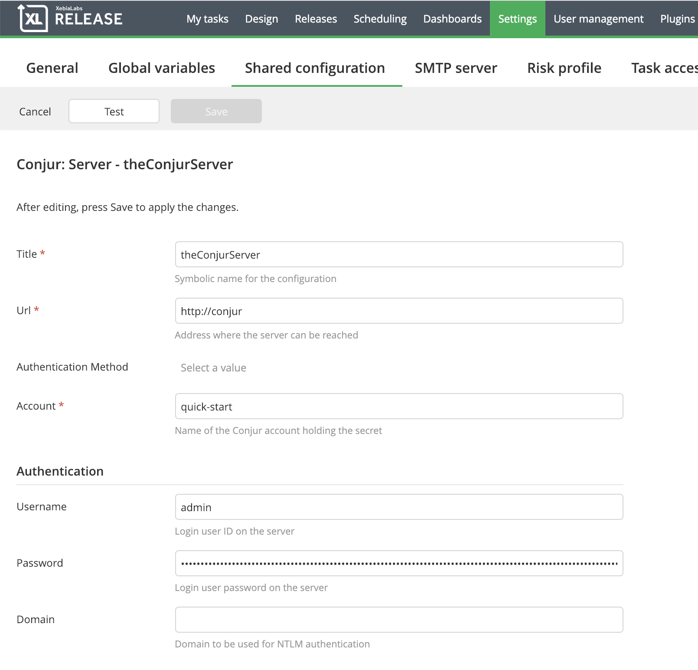
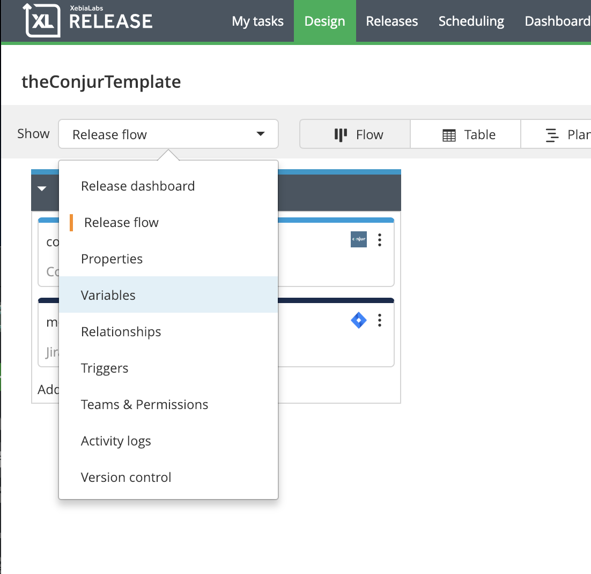
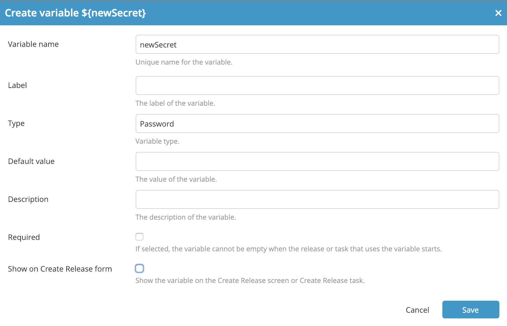
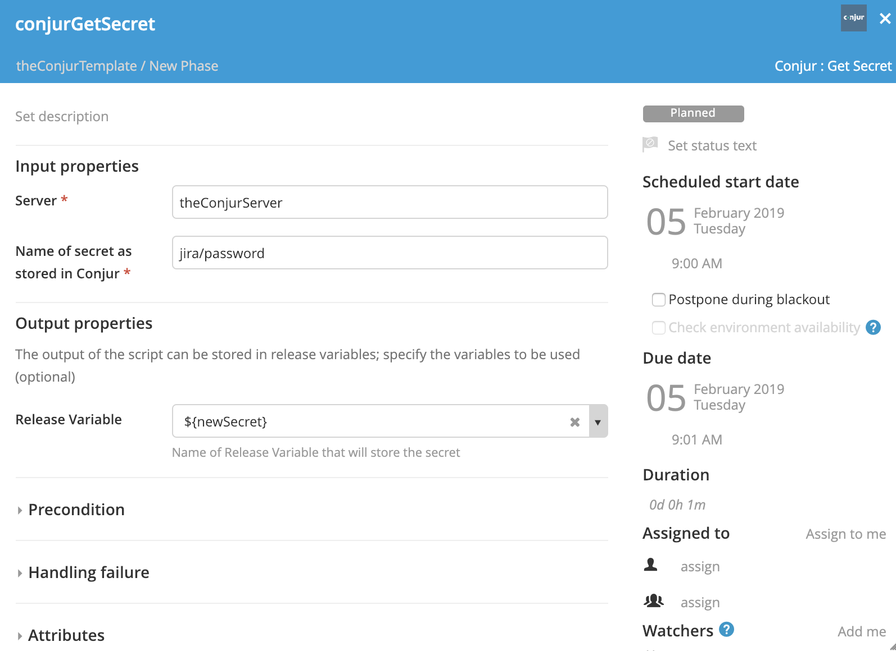
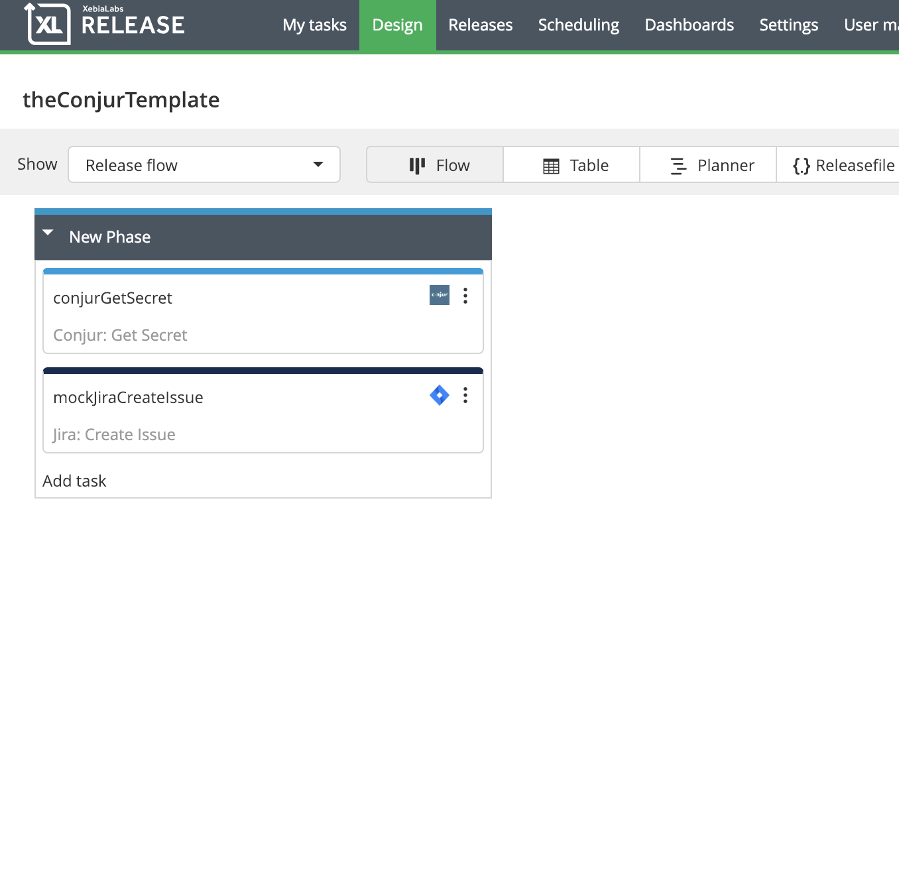
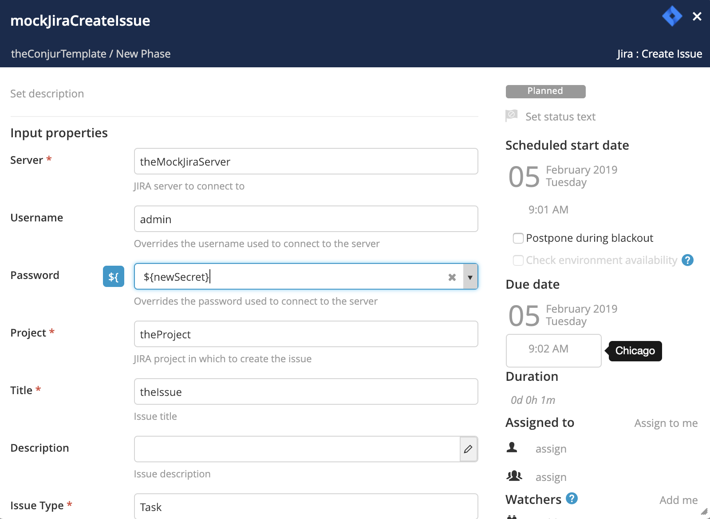

# XL Release Conjur Plugin #

## CI status ##

[![Build Status][xlr-conjur-travis-image] ][xlr-conjur-travis-url]
[![Codacy Badge][xlr-conjur-plugin-codacy-image] ][xlr-conjur-plugin-codacy-url]
[![Code Climate][xlr-conjur-plugin-code-climate-image] ][xlr-conjur-plugin-code-climate-url]
[![License: MIT][xlr-conjur-plugin-license-image] ][xlr-conjur-plugin-license-url]
[![Github All Releases][xlr-conjur-plugin-downloads-image] ]()

[xlr-conjur-travis-image]: https://travis-ci.org/xebialabs-community/xlr-conjur-plugin.svg?branch=master
[xlr-conjur-travis-url]: https://travis-ci.org/xebialabs-community/xlr-conjur-plugin
[xlr-conjur-plugin-codacy-image]: https://api.codacy.com/project/badge/Grade/88dec34743b84dac8f9aaaa665a99207
[xlr-conjur-plugin-codacy-url]: https://www.codacy.com/app/ladamato/xlr-conjur-plugin

[xlr-conjur-plugin-code-climate-image]: https://codeclimate.com/github/xebialabs-community/xlr-conjur-plugin/badges/gpa.svg
[xlr-conjur-plugin-code-climate-url]: https://codeclimate.com/github/xebialabs-community/xlr-conjur-plugin
[xlr-conjur-plugin-license-image]: https://img.shields.io/badge/License-MIT-yellow.svg
[xlr-conjur-plugin-license-url]: https://opensource.org/licenses/MIT
[xlr-conjur-plugin-downloads-image]: https://img.shields.io/github/downloads/xebialabs-community/xlr-conjur-plugin/total.svg


## Overview ##

This document describes the functionality provided by the xlr-conjur-plugin.
This plugin provides the ability to populate a release variable with secret retrieved from a Conjur server. The release variable can then be used by subsequent tasks in the release. 

See the **XL Release Reference Manual** for background information on XL Release and release concepts.

* **Requirements**
  * **XL Release** 7.5.0+
  * **Conjur** 4.9+


## Installation ##

* Copy the latest JAR file from the [releases page](https://github.com/xebialabs-community/xlr-conjur-plugin/releases) into the `XL_RELEASE_SERVER/plugins/__local__` directory.
* Restart the XL Release server.


## Usage ##

### Configure the Conjur Server ###

Begin by configuring one or more Conjur servers.  Navigate to **Settings -> Shared configuration** and add a Conjur: Server.



Enter a descriptive name for this server.

#### URL ####

Enter the full URL to the Conjur server from which secrets can be retrieved.  Include protocol (http or https) and port number if applicable.

#### Authentication Method ####

Choose the Basic Method from the drop down list. You may need to click the entry area to activate the drop down.

#### Account ####

Enter the enter the name of the Conjur account where the secrets are stored.

#### Username ####

Enter the account username that has permissions to retrieve the secret or secrets.

#### Password ####

Enter the user KEY in the password entry field.

#### Proxy ####

Optional proxy information if you access the Conjur server through a proxy.

---
### Using the xlr-conjur Plugin ###
The Conjur plugin provides a task called 'Get Secret' which will populate a single release variable with a single Conjur secret. As you create your template, you will need to create as many release variables as the number of distinct secrets you will need to run your tasks. 

Name the variable, make sure it is of type 'Password' and uncheck the boxes for 'Required' and 'Show on Release Form'.




### Get Secret Task ###
Within your template, you will need to add as many 'Get Secret' tasks as the number of release variables you will need to populate. To configure a task choose the Conjur Server, provide the name of the secret as stored in Conjur, and choose a release variable of type password to populate. 



The Get Secret task should be placed in the template so that it runs right before the task that will need the secret. In this example, the Get Secret task retrieves a secret password that will be used in the following JIRA 'Create Issue' task. 

#### Example Template ####




### Use the Secret as Part of Another Task ###
In this example, the Conjur Get Secret task is followed by a JIRA Create Issue task. The JIRA task makes use of the release variable 'newSecret' (previously populated by Conjur) as the JIRA password (overriding the password configured for the JIRA server).




---


## Developers ##

Build and package the plugins with...

```bash
./gradle assemble
```

Run end to end integration tests - note: 
1. Integration Testing does not work on Windows (yet)
2. You will need to have docker and docker-compose installed. 
3. The most recent version of your plug-in jar should be in your project build/libs directory. Running the gradle task 'assemble' before running the integrationTest will create the jar and place it in the libs directory.

```bash
./gradlew clean assemble integrationTest
```

